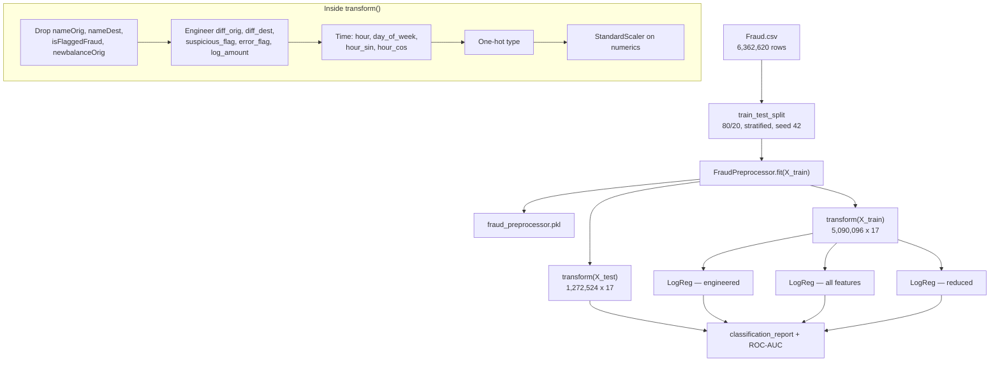

<h1 align="center">Fraud Transaction Detection</h1>

<p align="center">
  A reusable <code>FraudPreprocessor</code> transformer and three logistic-regression variants over<br>
  6.36 million PaySim mobile-money transactions, where 1 row in 775 is fraudulent.
</p>

<p align="center">
  
  
  
  
  
  
  
  <br>
  <a href="https://vishnujannarayanan.github.io/Fraud_Transaction_Detection/"></a>
  <br>
  <a href="https://www.kaggle.com/datasets/ealaxi/paysim1"></a>
  <br>
  <a href="https://vishnujan-narayanan.vercel.app/"></a>
  <a href="https://github.com/VishnujanNarayanan"></a>
  <a href="https://www.linkedin.com/in/vishnujan-narayanan"></a>
  <a href="https://substack.com/@vishnujannarayanan"></a>
</p>

<p align="center">
  ▶️ <a href="#live-demo">Demo</a> ·
  🎯 <a href="#why-this-project-exists">Why</a> ·
  🧩 <a href="#architecture">Architecture</a> ·
  📊 <a href="#results">Results</a> ·
  🧠 <a href="#design-decisions">Design Decisions</a> ·
  ⚡ <a href="#installation">Installation</a> ·
  🔍 <a href="#findings">Findings</a> ·
  🧪 <a href="#testing-and-ci">Testing</a> ·
  ⚠️ <a href="#limitations">Limitations</a>
</p>

---

## Live demo

**[vishnujannarayanan.github.io/Fraud_Transaction_Detection](https://vishnujannarayanan.github.io/Fraud_Transaction_Detection/)**

Enter a transaction and see it scored, with the five features that drove the score.

The model runs **in your browser**. The page ships the fitted coefficients, the scaler
moments and the one-hot categories as a few kilobytes of JSON, and reimplements
`FraudPreprocessor.transform` plus the sigmoid in JavaScript. There is no server, so there
is no cold start — a hosted free tier would sleep and make the first visitor wait the better
part of a minute.

Reimplementing a model in a second language is how a demo comes to confidently disagree with
the model it claims to be, so `tests/test_browser_parity.py` extracts the page's real script,
runs it in Node, and asserts it matches scikit-learn to 1e-9 on live rows.

## Why this project exists

Fraud detection is an extreme class-imbalance problem, and most of the difficulty is not in the
model — it is in the feature engineering and in choosing metrics that do not flatter a useless
classifier. With 1,643 fraudulent rows among 1.27 million, a model that predicts "never fraud"
scores 99.87% accuracy.

This project builds the preprocessing as a reusable `sklearn` transformer rather than a script of
inline mutations, so the same feature engineering can be fitted on train and applied unchanged to
test or to future data. It then trains three logistic-regression variants to isolate how much of
the performance comes from engineered features versus raw columns.

> A later, expanded treatment of this dataset — with 15 figures, average-precision scoring, and a
> shared visual style — lives in
> [nexora_submission](https://github.com/VishnujanNarayanan/nexora_submission).

## Features

- **`FraudPreprocessor`** — a `BaseEstimator` / `TransformerMixin` class implementing `fit` and
  `transform`, persistable with `joblib`.
- **Leakage and identifier removal** — `nameOrig`, `nameDest`, and `isFlaggedFraud` dropped.
- **Multicollinearity handling** — `newbalanceOrig` dropped (r = 1.00 with `oldbalanceOrg`).
- **Engineered features** — balance deltas, a balance-anomaly flag, log-scaled amount, and
  cyclical time encodings.
- **One-hot encoding** of transaction type with `handle_unknown="ignore"`.
- **Standardisation** of the four numeric columns.
- **Hypothesis testing** — chi-square for type-vs-fraud independence, Mann–Whitney U for the
  amount distribution.
- **Three model variants** compared on identical splits.
- **SQL analytics layer** — the EDA aggregations expressed as nine named queries against
  SQLite, so they are checkable by anyone who reads SQL and do not pull 6.36M rows into memory.
- **Honest metrics** — average precision alongside ROC-AUC, a precision/recall/alert-volume
  threshold sweep, and an F-beta operating point that weights recall over precision.
- **A real pipeline** — `src.train` persists the model, preprocessor, column order, metrics
  and ranked coefficients; `src.predict` scores a CSV with them.
- **61 tests and CI** — ruff and pytest on every push and pull request, plus a Docker image
  that CI builds and runs.
- **A browser demo** that loads instantly and needs no server.

## Architecture



## Results

Held-out 20% split: **1,272,524 transactions, 1,643 fraudulent** (0.129%).

| Model | ROC-AUC | Precision (fraud) | Recall (fraud) | F1 (fraud) | Accuracy |
|---|---|---|---|---|---|
| Logistic Regression — engineered | 0.9947 | 0.0369 | **0.9531** | 0.0711 | 0.9678 |
| Logistic Regression — all features | 0.9947 | 0.0369 | 0.9531 | 0.0711 | 0.9678 |
| Logistic Regression — reduced | 0.9946 | 0.0361 | **0.9556** | 0.0697 | 0.9670 |

The engineered and all-features rows are byte-identical because both resolve to the same 17
columns after preprocessing — the comparison as written does not isolate anything.

**Recall is high and precision is very low.** At the default 0.50 threshold the model catches
95.3% of fraud while roughly 1 alert in 27 is genuine. Whether that trade is acceptable depends
on the cost of a missed fraud against the cost of an analyst reviewing a false alert.

### Learned coefficients — engineered model

| Feature | Coefficient |
|---|---|
| `type_CASH_OUT` | 11.460 |
| `suspicious_flag` | 5.763 |
| `type_TRANSFER` | 5.718 |
| `diff_orig` | 3.436 |
| `hour_cos` | 0.639 |
| `hour_sin` | 0.461 |
| `step` | 0.420 |
| `oldbalanceOrg` | 0.389 |
| `oldbalanceDest` | 0.028 |
| `error_flag` | **0.000** |
| `always_nonfraud_type` | **0.000** |
| `day_of_week` | −0.027 |
| `newbalanceDest` | −0.168 |
| `amount` | −0.237 |
| `hour` | −0.396 |

Two features have coefficients of exactly zero and carry no information — see
[Findings](#findings).

## Design Decisions

**Preprocessing is a class, not a script.** Inline cleaning in a notebook cannot be re-applied to
new data without copy-pasting, and silently leaks test statistics into training whenever a scaler
is fitted on the full frame. `FraudPreprocessor` fits the encoder and scaler on train only, and
`transform` is a pure application of those fitted parameters.

**`newbalanceOrig` is dropped, but both destination balances are kept.** The origin pair is
perfectly correlated, so one is redundant. The destination pair is not — the *difference* between
them is exactly the anomaly signal that `suspicious_flag` encodes.

**Outliers in `amount` are retained.** Fraudulent transactions *are* the extreme values here;
trimming them removes the signal.

**`isFlaggedFraud` is dropped as leakage.** It is the dataset's own rule-based fraud label, not a
feature available before the fact.

**Time is derived from `step`, not used raw.** `step` is an hour counter over a 744-hour
simulation. `hour = step % 24` recovers the time of day, and sine/cosine encodings keep 23:00 and
00:00 adjacent rather than maximally distant.

**`class_weight="balanced"`** is used instead of resampling, so no synthetic rows are introduced
and the 6.36M-row dataset never needs duplicating in memory.

## Project Structure

```
Fraud_Transaction_Detection/
├── Fraud_Detection_Model.ipynb   # EDA, hypothesis tests, three models — the narrative
├── src/
│   ├── preprocessor.py           # FraudPreprocessor, the transformer the notebook defined
│   ├── db.py                     # CSV -> SQLite loader and named-query runner
│   ├── queries.sql               # Nine analytics queries, each documented
│   ├── train.py                  # Fit, evaluate, persist every artifact
│   ├── evaluate.py               # Average precision, threshold sweep, F-beta operating point
│   ├── predict.py                # Score a CSV with the persisted artifacts
│   └── export_web.py             # Export the model to JSON for the browser demo
├── tests/                        # 61 tests over synthetic PaySim-shaped fixtures
├── docs/                         # The static demo served by GitHub Pages
├── .github/workflows/            # ci.yml (lint, test, docker) and pages.yml (deploy)
├── Dockerfile
├── Data Dictionary.txt           # Column definitions from the dataset authors
├── requirements.txt              # Runtime dependencies
├── requirements-dev.txt          # Adds pytest and ruff
└── README.md
```

`Fraud.csv` (~470 MB) and the generated `fraud_preprocessor.pkl` are gitignored — one is
downloaded, the other produced by the notebook.

## Installation

Clone the repository:

```bash
git clone https://github.com/VishnujanNarayanan/Fraud_Transaction_Detection.git
cd Fraud_Transaction_Detection
```

Create a virtual environment and install dependencies:

```bash
python3 -m venv env
source env/bin/activate      # Linux / macOS
env\Scripts\activate         # Windows
pip install -r requirements.txt
```

### Getting the data

The notebook expects `Fraud.csv` beside it. Download
[PaySim on Kaggle](https://www.kaggle.com/datasets/ealaxi/paysim1) and unzip it in the project
root:

```bash
# Requires ~/.kaggle/kaggle.json
kaggle datasets download -d ealaxi/paysim1
unzip paysim1.zip
```

## Usage

The notebook is the narrative; the command line is the pipeline.

> Every command below assumes the virtual environment from
> [Installation](#installation) is **activated** — that is what makes `python` resolve. On a
> system where it is not, use `python3` instead; Debian and Ubuntu ship no bare `python`.

**Train and persist everything:**

```bash
python -m src.train                          # add --reduced to drop the weak features
python -m src.train --csv /path/to/Fraud.csv # or point it anywhere
```

`Fraud.csv` must be present first — see [Getting the data](#getting-the-data). It is a 470 MB
download and is deliberately gitignored, so this is the one step that cannot be automated for you.

Writes `artifacts/`: the fitted preprocessor, the model, the column order, the metrics and the
coefficients ranked by absolute weight.

**Score new transactions:**

```bash
python -m src.predict incoming.csv --out scored.csv --alerts-only
```

Defaults to the threshold chosen at training time, overridable with `--threshold`.

**Run the SQL analytics:**

```bash
python -m src.db --build         # load Fraud.csv into artifacts/fraud.db, then run every query
python -m src.db --query fraud_by_type
```

**Publish the browser demo:**

```bash
python -m src.export_web         # writes docs/model.json
```

**Or read it as a notebook:**

```bash
jupyter notebook Fraud_Detection_Model.ipynb
```

To reuse the fitted preprocessing on new data:

```python
import joblib
import pandas as pd

pre = joblib.load("fraud_preprocessor.pkl")
new_rows = pd.read_csv("incoming_transactions.csv")
X = pre.transform(new_rows)      # same 17 columns, same scaling as training
```

Note that only the preprocessor is persisted; the trained models are not saved.

## Configuration

| Setting | Value | Where |
|---|---|---|
| Input file | `Fraud.csv` | `pd.read_csv` in the training cell |
| Test split | 0.2, stratified on `isFraud` | `train_test_split` |
| Random seed | 42 | `train_test_split` |
| Class weighting | `balanced` | `LogisticRegression` |
| Log transform | `True` | `FraudPreprocessor(log_transform=True)` |
| Numeric features scaled | `amount`, `oldbalanceOrg`, `oldbalanceDest`, `newbalanceDest` | `FraudPreprocessor` |
| Types dropped at fit | `PAYMENT`, `DEBIT`, `CASH_IN` | `FraudPreprocessor.fit` |

## Engineered Features

| Feature | Definition |
|---|---|
| `diff_orig` | `oldbalanceOrg − newbalanceOrig` — money that left the sender |
| `diff_dest` | `newbalanceDest − oldbalanceDest` — money that reached the recipient |
| `suspicious_flag` | Amount was sent but the destination balance did not change |
| `error_flag` | Invalid or negative balances |
| `log_amount` | `log1p(amount)` — compresses a range spanning eight orders of magnitude |
| `hour` | `step % 24` |
| `day_of_week` | `step % 168` (see [Limitations](#limitations)) |
| `hour_sin`, `hour_cos` | Cyclical encoding of `hour` |
| `always_nonfraud_type` | Marks `PAYMENT` / `DEBIT` / `CASH_IN` |

## Statistical Tests

| Test | Question | Result |
|---|---|---|
| Chi-square | Is fraud independent of transaction type? | χ² = 22,082.5, dof 4, p < 1e−300 |
| Mann–Whitney U | Do fraud and non-fraud amounts share a distribution? | U = 4.12e10, p < 1e−300 |

Both reject the null decisively. With 6.36M rows almost any real difference reaches significance,
so these confirm direction rather than importance — the effect sizes in
[Findings](#findings) are what matter.

## Findings

- **Transaction type dominates.** `type_CASH_OUT` carries a coefficient of 11.46, roughly twice
  the next strongest feature. Fraud occurs only in `CASH_OUT` and `TRANSFER`.
- **The balance-anomaly flag is the best engineered feature.** `suspicious_flag` — money leaves
  the sender but the recipient's balance never moves — ranks second at 5.76, ahead of
  `type_TRANSFER`.
- **`error_flag` is dead.** Its coefficient is exactly 0.000 because PaySim contains no negative
  balances, so the flag is identically zero across all 6.36M rows.
- **`always_nonfraud_type` is also exactly 0.000.** It is a linear combination of the
  never-fraud type dummies, so the model has no independent use for it.
- **Raw `amount` has a mildly negative coefficient (−0.237)** once `log_amount` and the balance
  deltas are present, even though fraudulent transactions average ~1.47M against ~178K for
  legitimate ones. The engineered features have absorbed the signal.
- **Dropping weak features costs almost nothing.** The reduced model gives up 0.0001 ROC-AUC and
  actually gains recall (0.9531 → 0.9556).

## Dependencies

| Package | Why |
|---|---|
| `pandas` / `numpy` | Loading and transforming 6.36M rows |
| `scikit-learn` | `BaseEstimator` / `TransformerMixin`, encoding, scaling, models, metrics |
| `scipy` | `chi2_contingency` and `mannwhitneyu` |
| `matplotlib` / `seaborn` | EDA plots |
| `joblib` | Persisting the fitted preprocessor |

## Testing and CI

```bash
pip install -r requirements-dev.txt
pytest
ruff check .
```

61 tests, running in about a second. `Fraud.csv` is a 470 MB gitignored download that CI can
never see, so every test builds its own PaySim-shaped frame — which also pins the column
contract the preprocessor depends on.

The tests worth knowing about:

| Test | Why it exists |
|---|---|
| Column stability across disjoint batches | A drifting column set desynchronises the coefficient vector and turns a working model into silent garbage |
| Scaler fitted on train only | The leakage this whole design is meant to prevent |
| SQL `suspicious_flag` matches the preprocessor's | The same concept written twice in two languages, which is exactly what drifts |
| `fraud_by_type` SQL equals the pandas groupby | If they disagree, one of them is wrong |
| ROC-AUC reads higher than average precision | If this fails, the argument for changing the headline metric no longer holds |
| Page JavaScript matches scikit-learn to 1e-9 | The deployed demo cannot silently disagree with the model |

### Docker

```bash
docker build -t fraud-detection .
docker run --rm fraud-detection                    # runs the test suite
docker run --rm -v "$PWD":/data fraud-detection \
  python -m src.train --csv /data/Fraud.csv
```

The image is pinned to the Python version CI runs, and CI builds and runs it on every pull
request — so the container is verified as a working environment, not merely as a layer that
built.

## Limitations

- **The three model variants are not actually three experiments.** The engineered and
  all-features runs produce identical numbers because they use the same 17 columns.
- **Only logistic regression is trained.** `RandomForestClassifier`, `XGBClassifier`, and
  `IsolationForest` are imported at the top of the notebook but never fitted. Any claim of a
  tree-based or unsupervised comparison in earlier versions of this document was unsupported.
- **`xgboost` is imported by the notebook but absent from `requirements.txt`**, so that import
  cell fails on a clean install. The extracted package in `src/` does not import it at all.
- **`day_of_week` is misnamed.** It computes `step % 168`, which is the hour-of-week (0–167), not
  a weekday index. Its coefficient is a near-zero −0.027, so it does no harm — but it does not
  mean what the name says.
- **ROC-AUC is the wrong headline metric here.** At 0.129% positives it is dominated by the
  1.27M easy negatives. The notebook still reports it alone; `src/evaluate.py` reports average
  precision alongside it, which is the honest measure.
- **Precision of 0.037 is not deployable as a hard classifier.** It is usable only as a scoring
  and triage layer, which is why `src/predict.py` emits a score and an alert flag rather than a
  verdict.
- **The operating threshold is a business decision this repo cannot make.** `pick_threshold`
  defaults to F-beta with beta=2, weighting recall twice as heavily as precision on the
  assumption that a missed fraud costs the transfer while a false alert costs a few minutes of
  an analyst's time. Real costs should replace that assumption.
- **PaySim is simulated.** Rules that hold in an agent-based simulation, such as fraud never
  appearing in three of five channels, should not be assumed to hold in production data.

## Roadmap

Done since the first version: average precision and a threshold sweep, model persistence, a
`FraudPreprocessor` test suite, a SQL analytics layer, a Docker image, CI, and a browser demo.

Still open:

- Fit the imported tree-based and unsupervised models, or remove the imports from the notebook.
- Rename `day_of_week` to `hour_of_week`, or compute `(step // 24) % 7`.
- Drop `error_flag` and `always_nonfraud_type` from the feature set. Both are provably
  zero-coefficient; they are kept for now so a model trained by `src.train` matches one trained
  in the notebook column for column.
- Calibrate the scores, so a 0.8 means something closer to an 80% chance of fraud.
- Backfill a precision-recall curve into the demo page.

## License

Released under the MIT License — free to use, modify and distribute, with attribution and
without warranty. The PaySim dataset is separately licensed CC BY-SA 4.0 by its authors.

## Acknowledgements

**PaySim** — an agent-based simulation of mobile-money transactions calibrated on logs from a
real African mobile-money service, published as
[Synthetic Financial Datasets For Fraud Detection](https://www.kaggle.com/datasets/ealaxi/paysim1)
(Lopez-Rojas et al.).

## Author

<p align="center">
  <strong>Vishnujan Narayanan</strong>
</p>

<p align="center">
  <a href="https://vishnujan-narayanan.vercel.app/"></a>
  <a href="https://github.com/VishnujanNarayanan"></a>
  <a href="https://www.linkedin.com/in/vishnujan-narayanan"></a>
  <a href="https://substack.com/@vishnujannarayanan"></a>
</p>
